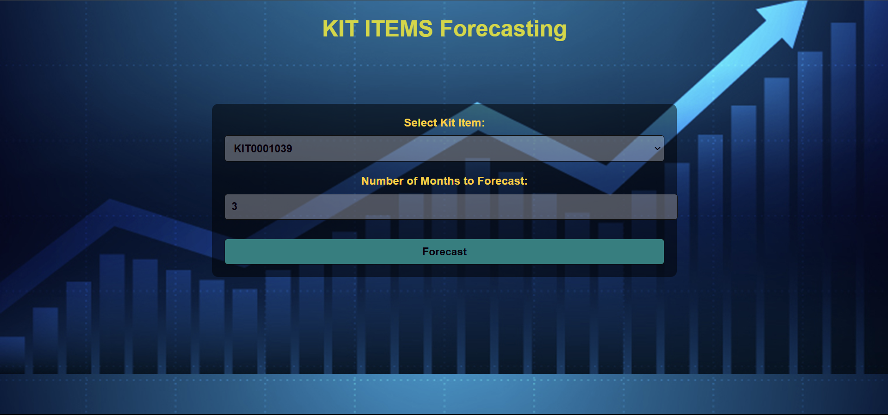

# Kit Items Forecasting Using ARIMA

This project aims to develop a predictive model for forecasting kit items for a leading automotive manufacturer. The primary objective is to maximize efficient kit delivery while ensuring supply consistency to meet customer demands.

## Table of Contents

* [Project Overview](#project-overview)
* [Tech Stack](#tech-stack)
* [Project Architecture](#project-architecture)
* [Features](#features)
* [Dataset](#dataset)
* [Results](#results)
* [Challenges](#challenges)
* [Future Scope](#future-scope)

## Project Overview

This project addresses the operational challenges faced by an automotive manufacturer in sourcing and delivering bespoke kit items from various suppliers. By implementing sophisticated inventory management techniques and predictive modeling, the project aims to optimize stock levels and reduce excess inventory.

## Tech Stack

* **Programming Language** : Python
* **Libraries** :
* Pandas for data manipulation
* NumPy for numerical operations
* Matplotlib and Seaborn for data visualization
* Statsmodels for ARIMA,SARIMA modeling
* **Development Environment** : Jupyter Notebook, VS Code

## Project Architecture

### A. Model Framework

The proposed system utilizes ARIMA (AutoRegressive Integrated Moving Average) to forecast the demand for various kit items. The model evaluates historical sales data to predict future inventory needs, thereby enabling efficient sourcing and supply chain management.

## Features

* **Accurate Forecasting** : Predicts demand for various kit items using historical data.
* **Data Visualization** : Provides visual insights into sales trends and forecast accuracy.
* **Exploratory Data Analysis** : Includes EDA to identify patterns and insights in the data.
* **Model Evaluation** : Evaluates the ARIMA models performance using MAPE scores.

## Dataset

* The dataset consists of 107 feature columns, including 106 columns representing the number of kit items and 1 column for dates.
* Each column contains 33 records, with labels as the names of different kit items.

## Results

* The ARIMA model achieved a MAPE score of less than 20 for 60 kit items and less than 24 for 80 kit items.
* Comparative analysis between actual and predicted values is provided in the results section.

## Challenges

* Obtaining accurate and comprehensive data for developing predictive models can be challenging.
* Continuous updates and refinements of the predictive models are necessary to adapt to changing market trends.

## Future Scope

* Advancements in AI and machine learning algorithms can enhance forecasting accuracy.
* Implementing IoT devices for real-time inventory data can improve proactive inventory management.

### Results

